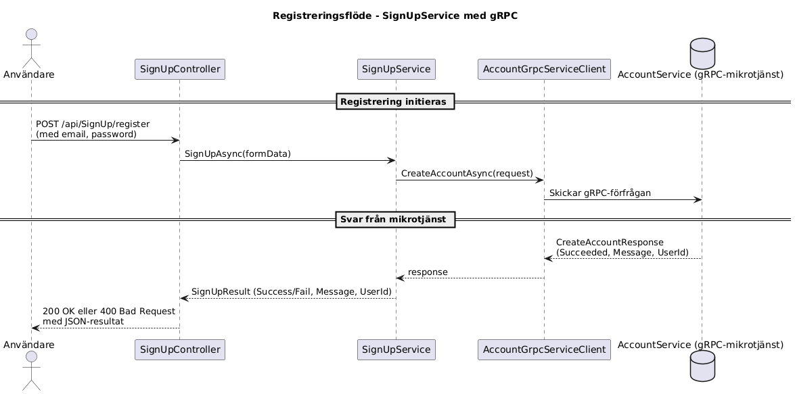

# SignUpProvider

SignUpProvider är en mikrotjänst byggd med ASP.NET Core Web API. Tjänsten tillhandahåller ett REST-API för användarregistrering och kommunicerar med en separat gRPC-baserad AccountService för att skapa användarkonton.

---

## Funktionalitet

- POST `/api/SignUp/register`: Registrerar en ny användare via e-post och lösenord.
- Kommunikation med gRPC-server via AccountGrpcServiceClient.
- Skydd av API:et via x-Api-Key-header.
- Dokumentation med Swagger UI.

---

## Teknologier

- .NET 9.0
- ASP.NET Core Web API
- gRPC Client
- Swagger / OpenAPI

---

## Kom igång

### 1. Klona projektet

```bash
git clone <https://github.com/CMS24-Grupp-5/SginUpProvider.git>
cd SignUpProvider
2. Konfigurera appsettings.json

Redigera
{
  "Providers": {
    "AccountServiceProvider": "https://localhost:5001"
  },
  "Apikeys": {
    "StandardApiKey": "din-hemliga-nyckel"
  }
}
3. Bygg och kör projektet

dotnet build
dotnet run
Swagger UI är tillgängligt på:

https://localhost:<port>/swagger

Säkerhet
Alla endpoints kräver att en giltig API-nyckel skickas med i HTTP-headern:
x-Api-Key: din-hemliga-nyckel
Exempel: Anrop och svar
POST /api/SignUp/register
Request body:    
{
  "email": "test@example.com",
  "password": "strongpassword123"
}

Response (200 OK):

{
  "success": true,
  "message": "Konto skapat.",
  "userId": "046d1e1b-cee8-44a8-a3b5-a826a9ccc15c"
}

Response (400 Bad Request):
{
  "success": false,
  "message": "Ogiltig e-postadress eller lösenord."
}
```

Kommunikation med gRPC
SignUpService anropar AccountGrpcServiceClient som är genererad från account.proto och skickar ett CreateAccountRequest till en extern gRPC-server. Servern svarar med ett CreateAccountResponse.

protobuf
```bash
service AccountGrpcService {
  rpc CreateAccount (CreateAccountRequest) returns (CreateAccountResponse);
}
```
---
Sekvensdiagram
Diagrammet nedan visar flödet från HTTP-anrop till gRPC och tillbaka:


